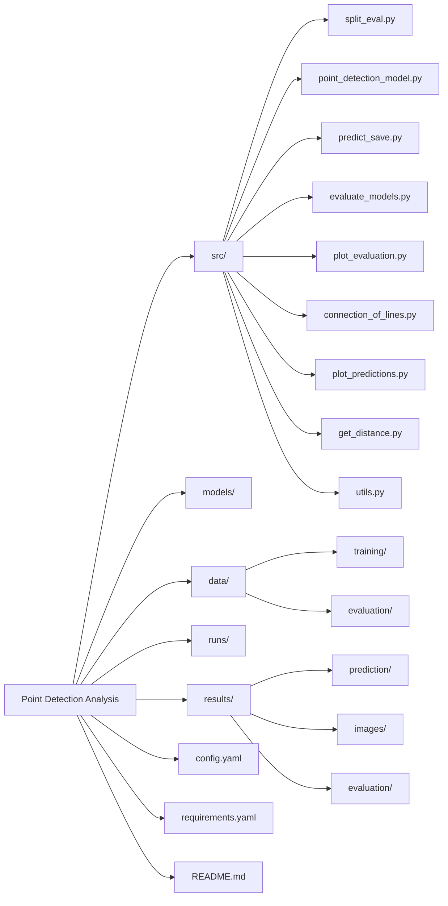
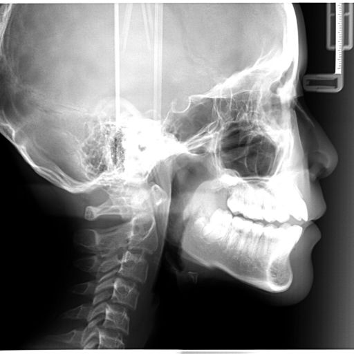
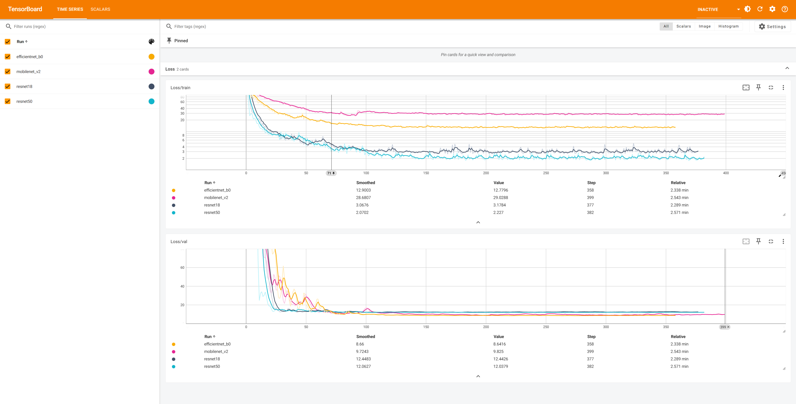
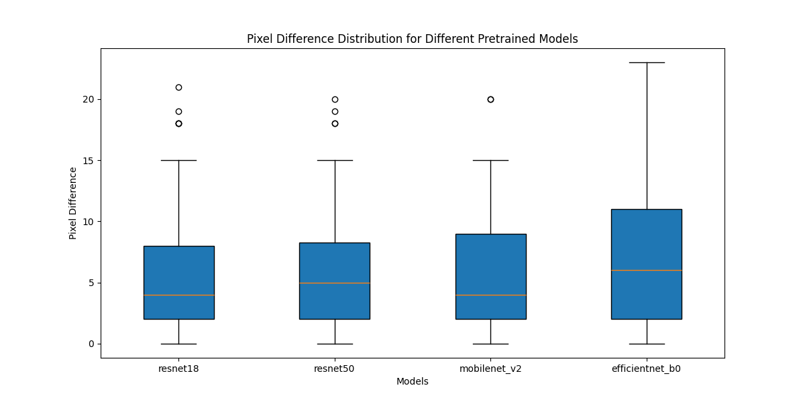
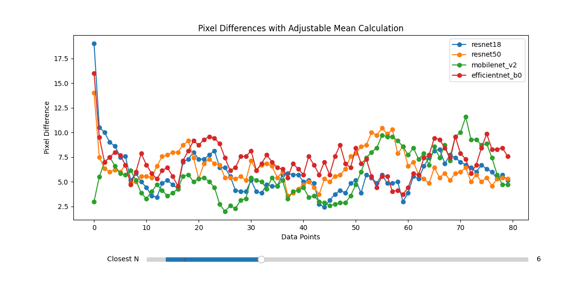
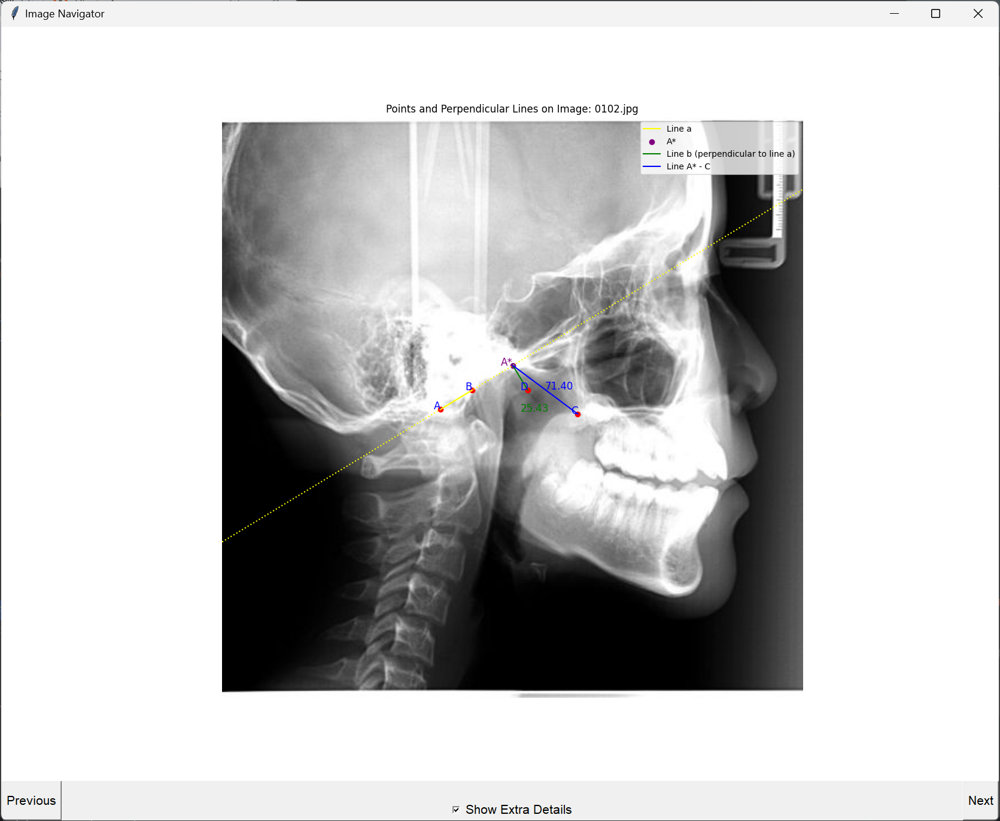
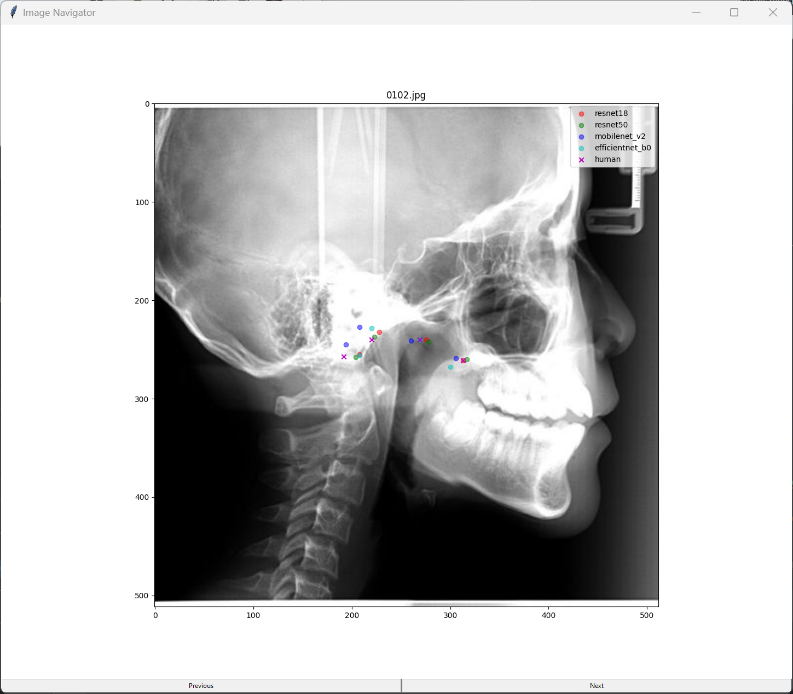

# Point Detection Analysis

This project contains multiple scripts designed to handle various tasks related to data splitting, model fine-tuning, prediction, evaluation, and visualization. Below is an overview of each script and its functionality.

## YouTube Tutorial

For a comprehensive guide on how to set up and use this project, watch our tutorial on YouTube:

[](https://www.youtube.com/watch?v=xW-G_ubGe08)

## Directory Structure
```

Point Detection Analysis/
│
├── src/
│   ├── split_eval.py
│   ├── point_detection_model.py
│   ├── predict_save.py
│   ├── evaluate_models.py
│   ├── plot_evaluation.py
│   ├── connection_of_lines.py
│   ├── plot_predictions.py
│   ├── get_distance.py
│   └── utils.py
│
├── models/
│
├── data/
│   ├── training/
│   └── evaluation/
│
├── runs/
│
├── results/
│   ├──prediction/
│   ├──images/
│   └── evaluation/
│ 
├── config.yaml
│
├── requirements.yaml
│
└── README.md
```


# Input Data Format

## Images
- **Format:** 512 x 512 .jpg format
- **Example:**
  

## Point Data
- Example Output:
- ```
    0102.jpg,192,257,220,240,313,261,269,240,0110.

If you want to input your own points or a different number of points, you will need to edit the part of the code that reads points because it is currently hard-coded.

# Software Overview

The software trains on images and four x,y points that define landmarks on the image. 4 Models were chosen and trained.


The final fully connected (FC) layer is replace with a new FC layer suitable for the number of landmarks to predict.

# The Models we used
We used the following models:
1. Resnet17
2. resnet50
3. mobilenet_v2
4. efficentnet_bo

Here is a detailed description of each model:

#### 1. ResNet18
ResNet18 is a part of the Residual Networks (ResNet) family, which introduced residual learning. ResNet18 has 18 layers and is relatively shallow compared to other ResNet variants. It uses residual blocks, which allow gradients to flow through the network more easily, preventing the vanishing gradient problem and enabling the training of deeper networks. ResNet18 is often used as a baseline model for various image classification tasks due to its simplicity and efficiency.

#### 2. ResNet50
ResNet50 is a deeper variant of the ResNet family, with 50 layers. It uses the same residual learning technique as ResNet18 but with more layers, allowing it to capture more complex features. ResNet50 consists of 1x1, 3x3, and 1x1 convolutions within its residual blocks. This architecture balances depth and computational efficiency, making it suitable for more complex image classification and recognition tasks.

#### 3. MobileNetV2
MobileNetV2 is designed for mobile and embedded vision applications. It uses depthwise separable convolutions, significantly reducing the number of parameters and computational cost. MobileNetV2 introduces inverted residuals with linear bottlenecks, which help preserve the model’s expressiveness while maintaining efficiency. This architecture is particularly suitable for scenarios where computational resources are limited, such as mobile devices.

#### 4. EfficientNet-B0
EfficientNet-B0 is part of the EfficientNet family, which uses a compound scaling method to balance network depth, width, and resolution. EfficientNet-B0 is the base model, designed to provide high accuracy while being computationally efficient. It employs a mobile inverted bottleneck convolution and squeeze-and-excitation optimization, making it effective for various image classification tasks with fewer parameters and FLOPs compared to other models with similar performance.

## Data Modification

All starting data should be placed in the `data/training` folder.

### `src/split_eval.py`
- **Functionality:** Splits the training data into two separate folders (`data/training` and `data/evaluation`) with an 8:2 ratio, randomly.
- **Example Output:** (plaintext)

## Training

### `src/point_detection_model.py`
- **Functionality:** Fine-tunes four pretrained models and saves them to the `models` directory. Outputs .txt files with predicted points for data in `data/evaluation`, saved to `results/prediction`.
- **Mid-Training Check:** TensorBoard is integrated for real-time monitoring. Run:
  ```bash
  tensorboard --logdir=runs
- Example Outputs:
 
- ```
    Training model: resnet18
    Epoch 1/400, Train Loss: 376.16 px, Val Loss: 384.76 px
    Epoch 2/400, Train Loss: 253.60 px, Val Loss: 1171.86 px
    Epoch 3/400, Train Loss: 138.34 px, Val Loss: 1300.62 px
    Epoch 4/400, Train Loss: 65.06 px, Val Loss: 1448.34 px
    Epoch 5/400, Train Loss: 41.60 px, Val Loss: 1294.18 px
    Epoch 6/400, Train Loss: 32.09 px, Val Loss: 1026.67 px
    Epoch 7/400, Train Loss: 31.98 px, Val Loss: 833.01 px
    Epoch 8/400, Train Loss: 27.33 px, Val Loss: 668.54 px
    Epoch 9/400, Train Loss: 24.71 px, Val Loss: 540.28 px
    Epoch 10/400, Train Loss: 21.58 px, Val Loss: 453.55 px


### `src/evaluate_models.py`
- **Functionality:** Uses data from (`data/evaluation`)  to evaluate four models. Outputs results as text files saved to (`results/evaluation`).
- Example Output:
- ```
    Mean Pixel Difference for resnet18: 5.575
    Mean Pixel Difference for resnet50: 6.325
    Mean Pixel Difference for mobilenet_v2: 5.675
    Mean Pixel Difference for efficientnet_b0: 6.9375

# Results and Visualizations

## Plot Evaluations

### `src/plot_evaluation.py`
- **Functionality:** Uses .txt files to plot boxplots and bar plots for pixel differences and mean pixel differences across different models.
- **Example:**
  
  
## Saving Predictions

### `src/predict_save.py`
- **Functionality:** Given model details and data paths, stores results as .txt files and saves plots of predicted points on images.
- Example Output:
- ```
    Saved coordinates to results/prediction\predictions_resnet18.txt
    Saved coordinates to results/prediction\predictions_resnet50.txt
    Saved coordinates to results/prediction\predictions_mobilenet_v2.txt
    Saved coordinates to results/prediction\predictions_efficientnet_b0.txt
  
## Visual Showcase

### `src/connection_of_lines.py`
- **Functionality:** Creates a GUI displaying mathematical results and predicted points on an image based on given data.
- **Example:**
  

### `src/plot_predictions.py`
- **Functionality:** Visualizes predicted points compared to original points on images.
- **Example:**
  

## Personal Math

### `src/get_distance.py`
- **Functionality:** Calculates distances from A* to D and A* to C using coordinates from a text file.
- Example Output:
- ```
    Image: 0102.jpg, Distance A* to C: 71.40, Distance A* to D: 25.43
    Image: 0110.jpg, Distance A* to C: 86.92, Distance A* to D: 44.55
    Image: 0113.jpg, Distance A* to C: 81.51, Distance A* to D: 36.63
    Image: 0118.jpg, Distance A* to C: 77.44, Distance A* to D: 29.75
# Usage

1. **split_eval.py**: Run this script to split your training data into two folders.
    ```bash
    python src/split_eval.py
    ```

2. **point_detection_model.py**: Fine-tune the pretrained models and save the outputs.
    ```bash
    python src/point_detection_model.py
    ```

3. **predict_save.py**: Use this script to generate prediction results and save plots.
    ```bash
    python src/predict_save.py
    ```

4. **evaluate_models.py**: Evaluate the models and output results.
    ```bash
    python src/evaluate_models.py
    ```

5. **plot_evaluation.py**: Plot the evaluation results.
    ```bash
    python src/plot_evaluation.py
    ```

6. **connection_of_lines.py**: Create a GUI to display predicted results on the images.
    ```bash
    python src/connection_of_lines.py
    ```
   
7. **plot_predictions.py**: Visualize the predicted points compared to the original points on the images.
    ```bash
    python src/plot_predictions.py
    ```
8. **plot_predictions.py**: Calculate the distances from A* to D and A* to C from a text file containing coordinates.
    ```bash
    python src/get_distance.py
    ```
   
## Reusable Utility Functions

The `src/utils.py` file contains reusable functions for reading and saving text files, creating directories, and loading images and coordinates, which are used across multiple scripts in this project.
